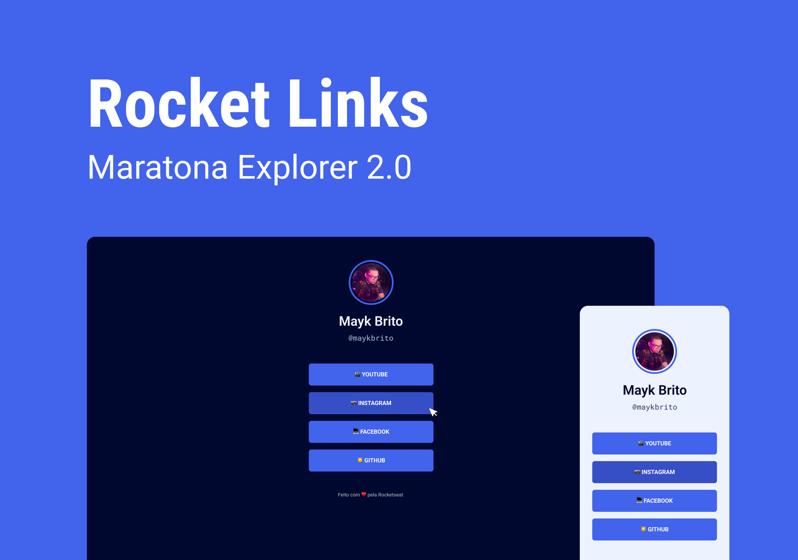

<h1 align="center"> Rocket Links </h1>

  <a href="#-tecnologias">Tecnologias</a>&nbsp;&nbsp;&nbsp;|&nbsp;&nbsp;&nbsp;
  <a href="#-projeto">Projeto</a>&nbsp;&nbsp;&nbsp;|&nbsp;&nbsp;&nbsp;
  <a href="#-layout">Layout</a>&nbsp;&nbsp;&nbsp;|&nbsp;&nbsp;&nbsp;
  <a href="#-aprendizado">Aprendizado</a>&nbsp;&nbsp;&nbsp;|&nbsp;&nbsp;&nbsp;
  <a href="#-crescimento">Crescimento</a>&nbsp;&nbsp;&nbsp;|&nbsp;&nbsp;&nbsp;
  <a href="#memo-licença">Licença</a>
  

  

 

  

## 🚀 Tecnologias

Esse projeto foi desenvolvido com as seguintes tecnologias:

-   ⛛. HTML e CSS
-   ⛛. JavaScript
-   ⛛. Git e Github
-   ⛛. Figma

## 💻 Projeto

O Rocket Links é um agregador de links para usar como cartão de visitas online.

-   [Acesse o projeto finalizado, online](https://letimberg.github.io/contacts/)

## 🔖 Layout

Você pode visualizar o layout do projeto através [DESSE LINK](https://www.figma.com/community/file/1125601602315782027/rocket-links-maratona-explorer-2-0). É necessário ter conta no [Figma](https://figma.com) para acessá-lo.

## 📚 Aprendizado

Neste projeto, adquiri um conhecimento sobre o uso de variáveis no CSS, o que me permitiu reutilizá-las em diversas partes do código, otimizando assim a eficiência e a manutenção do mesmo.

Trecho do código:

<pre>
    html {
        --bg-color: #121214;
        --text-color: #ffffff;
        --primary-color: #e1e1e6;
    }

    body {
        --bg-color: #202024;
        --text-color: #ffffff;
        --primary-color: #8257e6;
        --primary-color-dark: #956fed;
    }

    body.pink.active {
        --bg-color: #fff0f6;
        --text-color: #1f000b;
        --primary-color: #d6336c;
        --primary-color-dark: #a61e4d;
    }
</pre>

## 📊 Crescimento

Após a conclusão do projeto, um desafio é lançado visando o crescimento e a busca pelo próximo nível.

#### Nesse sentido, foram implementadas as seguintes melhorias:

-   Desenvolvemos um botão com a funcionalidade de alternância (toggle) que possibilita a alteração do tema do projeto.
-   Foi incluído um banner no topo.
-   Adicionalmente, foi incorporado um campo que lista as tecnologias nas quais o desenvolvedor possui conhecimento.

## :memo: Licença

Esse projeto está sob a licença MIT.

---

Feito com ♥ by Rocketseat :wave: [Participe da nossa comunidade!](https://discord.gg/rocketseat)
